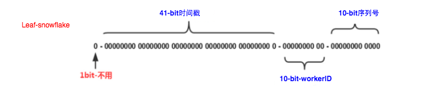

# Commons

## 项目简介
`commons` 是一个 Java 基础库，提供常用的工具和组件，会逐步完善。该项目采用 Apache 2.0 许可证，可自由使用和修改。

## 目录结构
```dtd
commons/
│── common-sharding-dao/    # 数据库分片
```

## 快速开始 
### 1. 唯一 ID 生成示例


snowflake算法生成ID，workid由zookeeper派发，保证唯一。监听zookeeper连接状态，如果zk断线，重新注册自己workid。
#### 添加依赖：
```xml
<dependency>
    <groupId>com.github.shun</groupId>
    <artifactId>common-sharding-dao</artifactId>
    <version>{last-version}</version>
</dependency>
```
#### 配置：
```yaml
zk:
  addresses: ${ZK_ADDRESSES:119.3.155.248:21811}
  sessionTimeoutMs: ${ZK_SESSIONTIMEOUTMS:60000}
  connectionTimeoutMs: ${ZK_CONNECTIONTIMEOUTMS:15000}
```
#### 启动类加入注解 `@EnableZkSnowFlake`
```java
@EnableZkSnowFlake
@SpringBootApplication
public class Application {
    public static void main(String[] args) {
        SpringApplication.run(Application.class, args);
        
    }
}
```
#### 使用：
```java
    @Autowired
    private SnowflakeKeyGenerator snowflakeKeyGenerator;

    // somewhere 生成唯一ID
    Long anyId = snowflakeKeyGenerator.generateKey();
```


